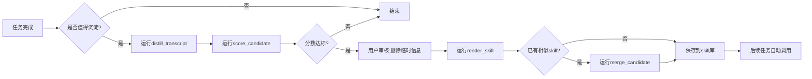

# 🧠 skill-skill: 打造你的个人skill库

<div align="center">

**✨ 面向高频AI协作用户的对话蒸馏与技能沉淀系统 ✨**

<div align="center">
  
  <p>✨ 让每一次 AI 协作，都沉淀为你的个人技能资产 ✨</p>
</div>


[](https://www.python.org/)
[](https://opensource.org/licenses/MIT)
[](https://github.com/your-username/skill-skill/pulls)
[](https://github.com/your-username/skill-skill/stargazers)

**不解决"这一轮怎么把prompt写得更强"，只解决"这一类任务以后应该怎么做"**

</div>

---

## 🎯 为什么你需要它？

> 💡 **AI协作的核心断层**：你明明已经和模型一起试出了完美流程，但下一次又要重新输入背景、规则和格式要求。经验没有变成资产，只变成了躺在历史里的聊天记录。

现有方案的痛点：
- ❌ 收藏prompt：只能保存文本，保存不了纠错过程、触发条件和使用边界
- ❌ 记忆功能：更适合存偏好和事实，不适合存一整套任务执行方法
- ❌ 历史搜索：能找回内容，但不能直接变成标准化复用能力
- ❌ 手写skill：门槛高，你永远不知道该提炼哪些内容

**skill-skill 做的事**：在你完成工作的自然流程中，自动发现值得沉淀的部分，半自动生成可复用的skill，帮你把聊天中的临时经验，变成可迁移的长期能力。

---

## ⚡ 快速上手 3步走

<div align="center">

| 📝 准备转录 | 🔍 生成候选 | 🚀 渲染技能 |
|:---:|:---:|:---:|
| 按标准格式保存对话 | 提取可迁移规则 | 生成可直接使用的skill |

</div>

```bash
# 1. 从对话转录提取候选规则
python distill_transcript.py your-conversation.md -o candidate.json

# 2. 评估是否值得沉淀（0-10分）
python score_candidate.py candidate.json -o score.json

# 3. 生成最终skill草稿
python render_skill.py candidate.json -o my-awesome-skill.md
```

**进阶**：如果已有相似skill，一键生成合并建议
```bash
python merge_candidate.py existing-skill.md candidate.json -o merge-report.md
```

---

## 🌟 三层核心价值

### 🛠️ 第一层：沉淀重复劳动
把同类任务里的**结构校准、格式要求、审查顺序、常见修正**全部固化下来，彻底消除每次重启对话的冷启动成本。

### 📋 第二层：规范skill创建
把"创建skill这件事本身"做成标准流程：
- ✅ 发现值得沉淀什么
- ✅ 如何起草初稿
- ✅ 怎么确认有效性
- ✅ 怎么合并旧skill

**解决元层级的重复劳动**，让你不用从零手写。

### 💎 第三层：积累个人方法资产
这是最独特也最有价值的一层：
- 你的文风、标题习惯、表达偏好
- 你的严谨程度、风险意识、审查重点
- 你试错无数次才打磨出来的工作流程

**这些不是通用知识，而是只属于你的核心竞争力**。一旦沉淀下来，迁移成本极高，粘性极强。

---

## 👥 谁应该用它？

<div align="center">

| 👨‍💻 程序员 | 📊 产品经理 | 📈 咨询顾问 | 🎨 运营策划 | 🎓 学生党 |
|:---:|:---:|:---:|:---:|:---:|
| 代码审查规范<br>提交信息标准<br>报错排查流程 | PRD模板<br>竞品分析框架<br>复盘方法论 | 行业研究<br>纪要整理<br>框架化输出 | 内容策划<br>活动复盘<br>用户访谈总结 | 论文润色<br>课程报告<br>面试准备 |

</div>

**特别适合**：
- 每天重度使用大模型3小时以上的人
- 已经形成个人工作方法，但懒得反复配置的人
- 团队里负责沉淀方法论、统一输出质量的人

---

## 🧩 四大核心模块

| 模块 | 功能 | 解决的问题 |
|:---|:---|:---|
| 🔍 **候选识别模块** | 先判断对话是否值得蒸馏，再生成内容 | 避免过度打扰，只在流程稳定时提示 |
| ⚗️ **蒸馏生成模块** | 把原始对话提炼成结构化skill，保留来源解释 | 自动区分通用规则、个人偏好和临时特例 |
| ✅ **轻确认模块** | 用户只做"保留/删除/分类/是否允许调用" | 最小化用户操作，不用重写一遍 |
| 📈 **版本演进模块** | 增量更新、冲突提示、归档建议、健康度跟踪 | 防止skill库爆炸和失控 |

---

## 🎯 适用 vs 不适用场景

| 类型 | ✅ 非常适合 | ❌ 不适合 |
|:---|:---|:---|
| **文档类** | 多轮打磨的PRD、竞品分析、周报、复盘模板 | 只改过1次的随手文案 |
| **工程类** | 代码审查口径、测试要求、提交信息规范 | 一次性的bug修复细节 |
| **个人方法** | 稳定的文风、结构、禁用表达、审查习惯 | 仅与某个项目相关的临时背景 |
| **skill维护** | 新规则并入旧skill，保留版本演进痕迹 | 只是想收藏几句提示词 |

---

## 📝 输入格式约定

**推荐使用结构化转录**，便于来源追溯：
```markdown
# 任务标题：写一份产品需求文档

## 第1轮
### 用户
帮我写一个AI聊天机器人的PRD

### 助手
[模型输出内容]

## 第2轮
### 用户
结构不对，应该先写目标用户，再写核心功能
```

脚本也接受简单的`用户:` / `助手:`行式转录，但效果会打折扣。

---

## 📜 完整命令行示例

### 1. 提取候选规则
```powershell
python .agents/skills/skill-skill/scripts/distill_transcript.py `
  .agents/skills/skill-skill/examples/prd-transcript.md `
  -o .agents/skills/skill-skill/examples/prd-candidate.json
```

### 2. 对候选结果打分
```powershell
python .agents/skills/skill-skill/scripts/score_candidate.py `
  .agents/skills/skill-skill/examples/prd-candidate.json `
  -o .agents/skills/skill-skill/examples/prd-score.json
```

### 3. 渲染为skill草稿
```powershell
python .agents/skills/skill-skill/scripts/render_skill.py `
  .agents/skills/skill-skill/examples/prd-candidate.json `
  --template .agents/skills/skill-skill/assets/skill_template.md `
  --source-label "examples/prd-transcript.md" `
  -o .agents/skills/skill-skill/examples/prd-rendered-skill.md
```

### 4. 合并已有skill与新候选
```powershell
python .agents/skills/skill-skill/scripts/merge_candidate.py `
  .agents/skills/skill-skill/examples/expected-prd-skill.md `
  .agents/skills/skill-skill/examples/prd-candidate.json `
  --template .agents/skills/skill-skill/assets/merge_template.md `
  -o .agents/skills/skill-skill/examples/prd-merge-report.md
```

---

## 🔄 推荐工作流



---

## 📁 项目结构

```text
skill-skill/
├── 📄 README.md              # 你正在看的这个文件
├── 📄 AGENTS.md              # 代理配置说明
└── 📂 .agents/skills/skill-skill/
    ├── 📄 SKILL.md           # skill-skill自身的skill定义
    ├── 📂 assets/            # 模板和资源文件
    │   ├── skill_template.md
    │   ├── merge_template.md
    │   └── eval_checklist.md
    ├── 📂 scripts/           # 核心脚本
    │   ├── distill_transcript.py
    │   ├── score_candidate.py
    │   ├── render_skill.py
    │   └── merge_candidate.py
    ├── 📂 examples/          # 完整示例
    └── 📂 references/        # 参考资料
```

---

## 📚 最佳实践：如何维护你的skill库

1. **一个skill只做一件事**：不要把多个不同任务硬塞进同一个skill
2. **永远保留规则来源**：避免半年后你自己都不知道这条规则为什么存在
3. **优先增量更新**：当旧skill与新候选相似时，合并而不是重复创建
4. **及时拆分**：当一个skill同时覆盖两类任务时，果断拆分
5. **定期清理**：每季度用`eval_checklist.md`做一次验收，淘汰不再使用的skill

---

## ⚠️ 真实边界（诚实说清楚它不能做什么）

> 🤝 **我们不做虚假承诺**。以下是skill-skill明确不能做的事：

- ❌ 不能自动读取你的聊天历史
- ❌ 不能跨会话自动触发
- ❌ 不能代替你做最终的规则判断
- ❌ 不能保证100%准确区分长期规则和临时特例
- ❌ 不能后台常驻监听你的输入
- ❌ 不能调用外部API补全缺失上下文
- ❌ 不能在你未确认的情况下，把候选规则直接写成最终skill
- ❌ 不能自动决定哪些规则一定属于长期资产，最终判断仍由你负责

---

## 🚀 触发方式

本项目严格按当前AI真实能力设计，不假装有后台系统：

1. **纯手动**：你明确说"帮我沉淀成skill"
2. **主动建议**：AI在当前会话中发现规则已稳定，提出是否需要沉淀（**推荐**）
3. **自动调用**：仅限你已经确认并保存过的skill，在后续相似任务中被识别并调用

---

## 🤔 常见问题

### Q: 通用层、个人层和当次特例有什么区别？
- **通用层**：跨同类任务都成立的方法、步骤、结构（如标准PRD框架）
- **个人层**：你自己的文风、标题习惯、风险偏好、禁用表达
- **当次特例**：只在当前项目、当前对象、当前时间窗口成立的要求

**这个区分直接决定了你的skill是否能长期复用**。

### Q: 什么时候应该触发蒸馏？
- 同一任务目标反复出现
- 你出现了高频纠偏（"以后都按这个来"）
- 输出约束逐渐稳定，连续几轮不再修改
- 明显具有跨任务可迁移性

### Q: 怎么避免过度提醒？
- 只在任务接近完成时提示
- 只在你连续2-3轮做同类修正时提示
- 提醒文案像助手，不像弹窗广告

---

## 🤝 贡献指南

欢迎提交PR！特别是：
- 更好的skill模板
- 更多行业的示例
- 评分算法的改进
- 文档翻译和优化

---

<div align="center">

**⭐ 如果这个项目对你有帮助，请给它一个star！**

**AI正在从一次性问答，转向长期协作。让我们一起把个人方法，变成可积累的数字资产。**

---

❤️ 

</div>
